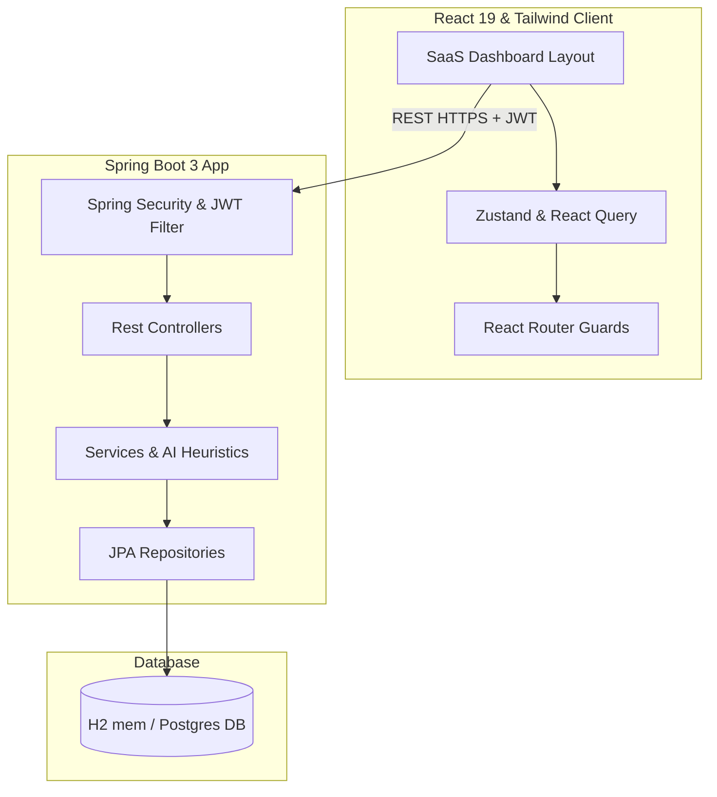

# Implementation Plan: UniSphere – Smart Campus Events & Clubs Hub

Create a production-grade full-stack web application for university event and club management with three user roles: Student, Faculty/Coordinator, and Admin.

---

## User Review Required

We recommend setting up the backend to support two database configurations (profiles):
1. **Development (`default` profile)**: Uses **H2 In-Memory Database in PostgreSQL compatibility mode**. This enables immediate local startup with zero configuration (`mvn spring-boot:run` works out-of-the-box without requiring a pre-installed PostgreSQL instance).
2. **Production (`prod` profile)**: Uses a standard **PostgreSQL** database connection. This can be enabled via system properties or environment variables (`spring.profiles.active=prod`).

> [!IMPORTANT]
> The H2 development database will automatically seed mock data (users, events, clubs, registrations) so you can log in as any role immediately. If you prefer to start directly with a real PostgreSQL database, please let us know your local PostgreSQL database credentials (username, password, port).

---

## Open Questions

> [!NOTE]
> 1. **Default Port Bindings**: We plan to run the Spring Boot backend on port `8080` and the React Vite dev server on port `5173`. If these ports are occupied on your machine, we can customize them.
> 2. **AI Mocking vs Heuristic Algorithms**: To provide a rich SaaS feel, we will implement actual heuristic AI logic in Java (e.g., scoring overlaps, major-category affinities, and collaborative filtering equations) rather than using random mock data. Let us know if you have specific scoring preferences.

---

## Proposed Changes

We will divide the workspace into two directories:
- `backend/`: Java 21, Spring Boot 3, Spring Security, JWT, JPA, Hibernate, Maven.
- `frontend/`: React 19, TypeScript, Vite, Tailwind CSS, Zustand, Framer Motion, Recharts.



### Backend (Spring Boot 3)

The backend will follow a standard N-tier architecture:

```
backend/
├── pom.xml
└── src/main/
    ├── java/com/unisphere/hub/
    │   ├── HubApplication.java
    │   ├── config/
    │   │   ├── SecurityConfig.java
    │   │   ├── JwtService.java
    │   │   ├── JwtAuthenticationFilter.java
    │   │   └── WebConfig.java (CORS configuration)
    │   ├── controller/
    │   │   ├── AuthController.java
    │   │   ├── EventController.java
    │   │   ├── ClubController.java
    │   │   ├── AttendanceController.java
    │   │   ├── NotificationController.java
    │   │   ├── AIController.java
    │   │   └── AdminController.java
    │   ├── dto/
    │   │   ├── AuthRequest.java
    │   │   ├── AuthResponse.java
    │   │   ├── RegisterRequest.java
    │   │   ├── EventDto.java
    │   │   ├── ClubDto.java
    │   │   ├── AttendanceDto.java
    │   │   ├── EngagementStatsDto.java
    │   │   └── AIRecommendationsDto.java
    │   ├── model/
    │   │   ├── User.java (implements UserDetails)
    │   │   ├── Role.java (Enum: STUDENT, FACULTY, ADMIN)
    │   │   ├── Event.java (Status: PENDING, APPROVED, REJECTED)
    │   │   ├── Club.java (Status: ACTIVE, PENDING)
    │   │   ├── Registration.java (Status: REGISTERED, CANCELLED)
    │   │   ├── Attendance.java
    │   │   ├── Notification.java
    │   │   ├── Feedback.java
    │   │   └── Recommendation.java
    │   ├── repository/
    │   │   ├── UserRepository.java
    │   │   ├── EventRepository.java
    │   │   ├── ClubRepository.java
    │   │   ├── RegistrationRepository.java
    │   │   ├── AttendanceRepository.java
    │   │   ├── NotificationRepository.java
    │   │   ├── FeedbackRepository.java
    │   │   └── RecommendationRepository.java
    │   └── service/
    │       ├── AuthService.java
    │       ├── EventService.java
    │       ├── ClubService.java
    │       ├── AttendanceService.java
    │       ├── NotificationService.java
    │       └── AIService.java (Algorithmic AI implementations)
    └── resources/
        ├── application.properties
        └── application-prod.properties
```

#### Database Schema Design
We will configure Hibernate to automatically construct these tables:
1. **users**: `id` (UUID/Long), `email` (unique), `password`, `name`, `role` (STUDENT, FACULTY, ADMIN), `department`, `profile_image`, `created_at`.
2. **clubs**: `id`, `name` (unique), `description`, `banner_image`, `status` (PENDING, ACTIVE), `creator_id` (FK users).
3. **events**: `id`, `title`, `description`, `date`, `time`, `location`, `max_capacity`, `status` (PENDING, APPROVED, REJECTED), `banner_image`, `category` (e.g., TECH, SPORTS, CULTURAL, ACADEMIC), `club_id` (FK clubs), `coordinator_id` (FK users), `engagement_score` (double).
4. **registrations**: `id`, `event_id` (FK events), `student_id` (FK users), `registration_date`, `status` (REGISTERED, CANCELLED), `pass_code` (unique QR token).
5. **attendance**: `id`, `event_id` (FK events), `student_id` (FK users), `checked_in_at`, `checked_by_id` (FK users).
6. **notifications**: `id`, `user_id` (FK users), `title`, `message`, `type` (ALERT, EVENT_APPROVAL, REGISTRATION), `is_read`, `created_at`.
7. **feedback**: `id`, `event_id` (FK events), `student_id` (FK users), `rating` (int), `comment`, `created_at`.
8. **recommendations**: `id`, `student_id` (FK users), `event_id` (FK events), `score` (double), `reason`.

#### Java AI Heuristics Implementation (`AIService`)
- **Event Recommendation Engine**: Calculates affinity score based on:
  - User's department matching the event's category.
  - Historical registrations (categories matching past registrations).
  - "Students Also Attended": Vector distance between registrations.
- **Smart Scheduling Suggestions**:
  - Scans events in the same week.
  - Scores target slot (0 to 1) based on location conflict, coordinator load, and time overlaps.
  - Suggests top 3 non-conflicting time slots.
- **Attendance Prediction**:
  - Predicts registration/attendance rate (0.0% to 100.0%) using regression approximation:
    `P = BaseRate(category) * CapacityFactor(maxCapacity) * DayOfWeekFactor(day) * ClubReputationFactor(club_ratings)`
- **Engagement Scoring**:
  - Formula: `Score = (Registrations / Capacity) * 40 + (FeedbackAverage / 5) * 40 + (AttendanceRate) * 20`

---

### Frontend (React 19 & Tailwind CSS)

We will initialize a clean Vite project inside `frontend/` and configure Tailwind.

```
frontend/
├── package.json
├── vite.config.ts
├── tailwind.config.js
├── postcss.config.js
├── src/
    ├── main.tsx
    ├── index.css
    ├── App.tsx
    ├── store/
    │   └── authStore.ts (Zustand state for user auth)
    ├── hooks/
    │   └── useApi.ts (React Query hooks for all endpoints)
    ├── components/
    │   ├── ui/ (Button, Input, Card, Badge, Dialog, Select, etc. - built with Tailwind)
    │   ├── Layout.tsx (Responsive navigation sidebar/header)
    │   ├── StatCard.tsx (Animated stat indicator)
    │   ├── EventCard.tsx (Glassmorphism layout with details and action button)
    │   ├── DigitalPass.tsx (QR Pass component)
    │   └── DarkModeToggle.tsx
    ├── pages/
    │   ├── Login.tsx (Dual sign-in/register with mock credentials quick-fill)
    │   ├── Dashboard.tsx (Root route directing to specific role page)
    │   ├── StudentDashboard.tsx
    │   ├── FacultyDashboard.tsx
    │   ├── AdminDashboard.tsx
    │   ├── EventsPage.tsx
    │   ├── ClubsPage.tsx
    │   └── Unauthorized.tsx
```

#### UI Design Aesthetics
- **Color Theme**: Deep indigo (`#4f46e5`), violet (`#7c3aed`), emerald (`#10b981`), and sleek slate backgrounds.
- **Glassmorphism**: Cards with backdrop blur `backdrop-blur-md bg-white/10 dark:bg-slate-900/40 border border-white/20 dark:border-slate-800/40 shadow-xl`.
- **Dynamic Elements**: Smooth entry transitions via Framer Motion, hover-scale items, and vibrant gradient buttons.
- **Dark/Light Mode**: Synced globally using class-based Tailwind.

---

## Verification Plan

### Automated Tests
- Run backend verification tests: `mvn clean test` (inside `backend/` directory).
- Verify frontend compilation: `npm run build` or `npx tsc` (inside `frontend/` directory).

### Manual Verification
1. Start Backend: `mvn spring-boot:run` (bound to `http://localhost:8080`).
2. Start Frontend: `npm run dev` (bound to `http://localhost:5173`).
3. Open Browser at `http://localhost:5173`.
4. Log in as:
   - **Student**: `student@unisphere.edu` / `password`
   - **Faculty**: `faculty@unisphere.edu` / `password`
   - **Admin**: `admin@unisphere.edu` / `password`
5. Test main actions:
   - **Student**: Browse events, view recommendations, register for an event, check QR code, submit feedback.
   - **Faculty**: Create an event, run AI smart scheduling, predict attendance, view registration logs, scan attendance.
   - **Admin**: Approve/reject events, view engagement stats and heatmaps, manage clubs and users.
