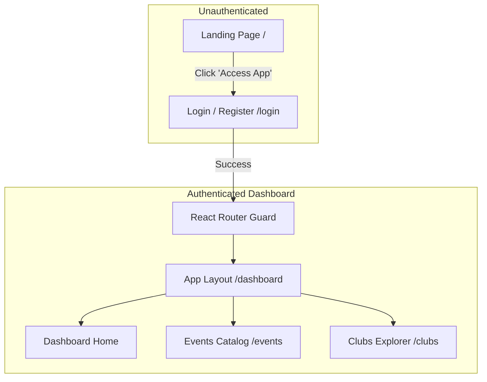

# Market-Ready Frontend Plan & Prompt: UniSphere – Campus Hub

This document contains a comprehensive analysis of the current frontend state of the **UniSphere** project, a plan for upgrading it to a market-ready SaaS application, and a detailed prompt designed to be fed to an AI agent or a front-end developer to execute the implementation.

---

## Codebase Analysis

The current front-end application is built using a modern, performant stack:
- **Core Framework**: React 19, TypeScript, and Vite.
- **Styling**: Tailwind CSS v4.3.0, integrated natively via `@tailwindcss/vite`.
- **State Management**: Zustand (for Authentication) and Redux Toolkit.
- **Data Fetching**: `@tanstack/react-query` (custom hooks mapping REST API controllers).
- **Icons & Animations**: `lucide-react` and `framer-motion`.
- **Visualizations**: `recharts` (custom interactive bar charts and donut charts).

### Strengths of the Current Setup
1. **Interactive Features**: The role-based dashboards (`StudentDashboard.tsx`, `FacultyDashboard.tsx`, `AdminDashboard.tsx`) are already feature-complete. They have advanced telemetry, smart scheduler slots, attendance prediction indicators, digital tickets, and custom calendars.
2. **Design Language**: It uses a sleek, locked dark mode (`#060814` and `#0b0e17`) with glassmorphism styling and radial gradients (`violet-600/10`, `indigo-600/10`), giving it a premium SaaS dashboard aesthetic.
3. **Data Mocking & API Integrations**: A SQLite backend and REST client endpoints are fully connected through Zustand stores and custom query hooks (`useApi.ts`).

### Areas for Improvement (Market-Readiness)
1. **No Public Landing Page**: There is no marketing homepage. Direct access to `/` redirects unauthenticated users to `/login`. A market-ready SaaS needs an introductory homepage displaying the value proposition (AI schedules, dashboard telemetries, ticketing) before driving users to log in.
2. **Router Configuration**: The application routing starts directly at `/login` or the dashboard layout. We need to introduce a `/landing` or configure `/` as a public marketing page, and move dashboard tools under a protected `/dashboard` layout path.
3. **Polish & Notifications**: The project needs a robust Toast Notification context to alert users during action updates (e.g. when checking in, proposing a club, or registering a seat) instead of standard browser `alert()` popups.

---

## Proposed System Architecture



---

## Detailed LLM Development Prompt

Below is the copy-pasteable prompt designed for an AI coder or front-end developer to build out this market-ready landing page and routing shell.

```markdown
# Front-End Task: Implement SaaS Landing Page & App Shell for UniSphere

You are an expert React 19 and Tailwind CSS developer. Your task is to build a market-ready public landing page and refine the routing structure of the UniSphere project to make it feel like a polished, commercial SaaS product.

## 1. Technical Stack
- React 19, TypeScript, Vite
- Tailwind CSS v4 (using `@tailwindcss/vite`)
- `lucide-react` for modern icons
- `framer-motion` for viewport animations
- `react-router-dom` v7 for routing

## 2. Core Enhancements Needed

### A. Create a Gorgeous Public Landing Page (`frontend/src/pages/LandingPage.tsx`)
- **Theme**: Slate/Black/Dark Blue space theme (`#060814`) with glassmorphism cards and vibrant glowing radial gradients (`indigo-500/15` and `violet-600/15`).
- **Typography**: Modern and readable, utilizing the `Outfit` sans-serif font family.
- **Responsive Navbar**: Brand logo (`UniSphere`), feature anchors (Features, Analytics, Live Demo, FAQ), and an "Access App" primary call-to-action button that routes to `/login`.
- **Hero Section**: 
  - Dynamic headline: "The Smart Campus Hub for Connected Student Life" with text-gradient gradients (`linear-gradient(135deg, #818cf8, #a78bfa, #f472b6)`).
  - High-fidelity visual mockup of the dashboard: An animated mock dashboard container with floating badges, stats, and real-time activity feeds.
- **Features Grid**: Lucide-icon-based boxes explaining:
  - 🧠 **AI Match Recommendations**: Customized student events recommendations calculated using vector affinity heuristics.
  - 📅 **Smart Scheduling Coordinator**: Automated time conflict solvers for campus coordinators.
  - 📊 **Telemetry Dashboards**: Institutional insights and real-time attendance analytics.
  - 🎫 **Digital Boarding Pass**: Instant QR pass generation for seamless event check-ins.
- **Interactive Live Demo Sandbox**: 
  - A small interactive simulator where a visitor can click a role (Student, Faculty, Admin) and see a mini-preview of what features they get, showing mock dashboard cards.
- **Pricing / Plans**: Standard mock pricing grid for institutions (Free Tier, Campus Pro, Enterprise Scale).
- **FAQ Accordion**: 3-4 collapsing panels addressing deployment and security.
- **Footer**: Brand disclaimer, links, and clean layout divider.

### B. Update Routing Configuration (`frontend/src/App.tsx`)
Modify `App.tsx` so that:
- `/` renders the new `LandingPage` component.
- `/login` remains the login page.
- Logged-in navigation redirects to `/dashboard`, which should be protected by the `ProtectedRoute` guard and render the main `Layout` and `Dashboard` pages.
- Ensure the layout navigation links in `Layout.tsx` are updated to match the new dashboard relative paths.

---

### Landing Page Implementation Template (`LandingPage.tsx`)
Create a new file `frontend/src/pages/LandingPage.tsx` with the following structure:

```tsx
import React, { useState } from 'react'
import { useNavigate } from 'react-router-dom'
import { 
  Sparkles, 
  ArrowRight, 
  Cpu, 
  Calendar, 
  BarChart3, 
  QrCode, 
  Check, 
  Menu, 
  X,
  ChevronDown
} from 'lucide-react'
import { motion } from 'framer-motion'

export const LandingPage: React.FC = () => {
  const navigate = useNavigate()
  const [mobileMenuOpen, setMobileMenuOpen] = useState(false)
  const [activeTab, setActiveTab] = useState<'student' | 'faculty' | 'admin'>('student')
  const [openFaq, setOpenFaq] = useState<number | null>(null)

  // Demo features switcher
  const demoContent = {
    student: {
      title: "Interactive AI Recommendations",
      desc: "Get event suggestions based on your department, interest affinity, and peer activity. Claims digital boarding passes directly to your device.",
      points: ["98% Match accuracy", "Dynamic XP point tracking", "Apple Wallet format compatibility"]
    },
    faculty: {
      title: "AI Smart Scheduling",
      desc: "Upload event drafts and let our recommendation heuristics find optimal non-conflicting time slots across academic departments.",
      points: ["Attendance rate estimation", "Auditorium conflict scanner", "Live QR attendee check-ins"]
    },
    admin: {
      title: "Campus Telemetry Console",
      desc: "Overview registration volumes, club engagement scales, and approval queues in one centralized administrative panel.",
      points: ["Pending club approval workflows", "Real-time system diagnostics", "CSV spreadsheet summaries"]
    }
  }

  return (
    <div className="min-h-screen w-full bg-[#060814] text-white overflow-hidden font-sans select-none relative">
      {/* Glow Effects */}
      <div className="absolute top-0 left-1/4 w-[600px] h-[600px] bg-violet-600/10 rounded-full blur-[140px] pointer-events-none" />
      <div className="absolute top-1/3 right-1/4 w-[600px] h-[600px] bg-indigo-600/10 rounded-full blur-[140px] pointer-events-none" />
      
      {/* Grid Overlay */}
      <div className="absolute inset-0 bg-[linear-gradient(to_right,#0f172a_1px,transparent_1px),linear-gradient(to_bottom,#0f172a_1px,transparent_1px)] bg-[size:4rem_4rem] [mask-image:radial-gradient(ellipse_60%_50%_at_50%_40%,#000_70%,transparent_100%)] opacity-25 pointer-events-none" />

      {/* Header Navbar */}
      <nav className="fixed top-0 left-0 right-0 z-50 glass-nav backdrop-blur-md">
        <div className="max-w-7xl mx-auto px-6 h-20 flex justify-between items-center">
          <div className="flex items-center gap-3">
            <div className="h-9 w-9 rounded-xl bg-indigo-600 flex items-center justify-center shadow-lg shadow-indigo-600/20">
              <Cpu className="h-4.5 w-4.5 text-white" />
            </div>
            <span className="font-extrabold text-xl tracking-tight">UniSphere</span>
          </div>

          {/* Desktop Nav */}
          <div className="hidden md:flex items-center gap-8 text-xs font-bold text-slate-400">
            <a href="#features" className="hover:text-white transition-colors">Features</a>
            <a href="#demo" className="hover:text-white transition-colors">Sandbox Demo</a>
            <a href="#pricing" className="hover:text-white transition-colors">Pricing</a>
            <a href="#faq" className="hover:text-white transition-colors">FAQ</a>
            <button 
              onClick={() => navigate('/login')}
              className="bg-indigo-600 hover:bg-indigo-500 text-white font-extrabold px-5 py-2.5 rounded-xl shadow-lg shadow-indigo-600/20 hover:scale-[1.02] active:scale-[0.98] transition-all"
            >
              Access App
            </button>
          </div>

          {/* Mobile Menu Btn */}
          <button className="md:hidden text-white" onClick={() => setMobileMenuOpen(!mobileMenuOpen)}>
            {mobileMenuOpen ? <X className="h-6 w-6" /> : <Menu className="h-6 w-6" />}
          </button>
        </div>

        {/* Mobile Navigation Panel */}
        {mobileMenuOpen && (
          <div className="md:hidden bg-[#0c101d] border-b border-slate-900 p-6 flex flex-col gap-4 text-sm font-bold text-slate-400 absolute top-20 left-0 right-0 shadow-2xl">
            <a href="#features" onClick={() => setMobileMenuOpen(false)} className="hover:text-white py-2">Features</a>
            <a href="#demo" onClick={() => setMobileMenuOpen(false)} className="hover:text-white py-2">Sandbox Demo</a>
            <a href="#pricing" onClick={() => setMobileMenuOpen(false)} className="hover:text-white py-2">Pricing</a>
            <a href="#faq" onClick={() => setMobileMenuOpen(false)} className="hover:text-white py-2">FAQ</a>
            <button 
              onClick={() => { setMobileMenuOpen(false); navigate('/login'); }}
              className="w-full bg-indigo-600 hover:bg-indigo-500 text-white font-bold py-3.5 rounded-xl mt-2 shadow-lg"
            >
              Access App
            </button>
          </div>
        )}
      </nav>

      {/* Hero Section */}
      <section className="pt-36 pb-24 px-6 max-w-7xl mx-auto text-center flex flex-col items-center">
        <motion.div 
          initial={{ opacity: 0, y: 20 }}
          animate={{ opacity: 1, y: 0 }}
          transition={{ duration: 0.6 }}
          className="space-y-6 max-w-3xl"
        >
          <div className="inline-flex items-center gap-2 px-3.5 py-1.5 rounded-full bg-indigo-500/10 border border-indigo-500/20 text-indigo-400 text-[10px] font-black uppercase tracking-wider">
            <Sparkles className="h-3 w-3 animate-pulse" />
            <span>AI-Driven Higher Ed Architecture</span>
          </div>
          <h1 className="text-4xl sm:text-6xl font-black tracking-tight leading-tight">
            The Connected Hub <br />
            For <span className="text-gradient">Modern Campus Life</span>
          </h1>
          <p className="text-slate-400 text-sm sm:text-base max-w-xl mx-auto leading-relaxed">
            Unify event management, club directories, and academic operations with predictive attendance AI, smart schedulers, and secure digital boarding passes.
          </p>
          <div className="flex flex-col sm:flex-row gap-4 justify-center pt-4">
            <button 
              onClick={() => navigate('/login')}
              className="bg-indigo-600 hover:bg-indigo-500 text-white font-extrabold px-8 py-4 rounded-2xl flex items-center justify-center gap-2 shadow-lg shadow-indigo-600/20 active:scale-[0.98] transition-all hover:scale-102 cursor-pointer"
            >
              <span>Initialize Workspace</span>
              <ArrowRight className="h-4.5 w-4.5" />
            </button>
            <a 
              href="#demo"
              className="bg-slate-900 hover:bg-slate-800 text-slate-300 font-extrabold px-8 py-4 rounded-2xl border border-slate-800 flex items-center justify-center transition-colors"
            >
              Watch Sandboxed Demo
            </a>
          </div>
        </motion.div>

        {/* Dashboard Mockup Preview */}
        <motion.div 
          initial={{ opacity: 0, y: 40 }}
          animate={{ opacity: 1, y: 0 }}
          transition={{ duration: 0.8, delay: 0.2 }}
          className="mt-16 w-full max-w-5xl rounded-3xl overflow-hidden border border-slate-800 bg-[#0c101d]/60 backdrop-blur p-4 md:p-6 shadow-2xl"
        >
          <div className="flex items-center justify-between border-b border-slate-900 pb-4 mb-4">
            <div className="flex gap-2">
              <span className="w-3 h-3 rounded-full bg-rose-500" />
              <span className="w-3 h-3 rounded-full bg-amber-500" />
              <span className="w-3 h-3 rounded-full bg-emerald-500" />
            </div>
            <div className="bg-[#121624] px-6 py-1 rounded-lg border border-slate-900 text-[10px] font-bold text-slate-500">
              https://unisphere.university.edu/dashboard
            </div>
            <div className="w-12" />
          </div>
          <div className="grid grid-cols-12 gap-4 text-left">
            <div className="col-span-3 bg-[#121624]/60 border border-slate-900 rounded-2xl p-4 h-64 space-y-4">
              <div className="w-20 h-4 bg-slate-800 rounded" />
              <div className="space-y-2">
                <div className="w-full h-8 bg-slate-900 rounded-lg" />
                <div className="w-full h-8 bg-slate-900 rounded-lg" />
                <div className="w-full h-8 bg-slate-900 rounded-lg" />
              </div>
            </div>
            <div className="col-span-9 bg-[#121624]/60 border border-slate-900 rounded-2xl p-6 h-64 space-y-6">
              <div className="flex justify-between items-center">
                <div className="space-y-1.5">
                  <div className="w-36 h-5 bg-slate-800 rounded" />
                  <div className="w-48 h-3.5 bg-slate-950 rounded" />
                </div>
                <div className="w-16 h-8 bg-indigo-600/20 rounded-full" />
              </div>
              <div className="grid grid-cols-3 gap-4">
                <div className="h-28 bg-[#060814]/80 rounded-2xl border border-slate-900 p-4 space-y-2">
                  <div className="w-12 h-3.5 bg-emerald-500/10 rounded" />
                  <div className="w-8 h-6 bg-slate-800 rounded" />
                </div>
                <div className="h-28 bg-[#060814]/80 rounded-2xl border border-slate-900 p-4 space-y-2">
                  <div className="w-12 h-3.5 bg-indigo-500/10 rounded" />
                  <div className="w-8 h-6 bg-slate-800 rounded" />
                </div>
                <div className="h-28 bg-[#060814]/80 rounded-2xl border border-slate-900 p-4 space-y-2">
                  <div className="w-12 h-3.5 bg-violet-500/10 rounded" />
                  <div className="w-8 h-6 bg-slate-800 rounded" />
                </div>
              </div>
            </div>
          </div>
        </motion.div>
      </section>

      {/* Features Grid Section */}
      <section id="features" className="py-24 px-6 max-w-7xl mx-auto scroll-mt-20">
        <div className="text-center max-w-2xl mx-auto space-y-4 mb-16">
          <h2 className="text-3xl font-black tracking-tight sm:text-4xl">Engineered for Academic Precision</h2>
          <p className="text-slate-400 text-xs sm:text-sm">UniSphere eliminates scheduling overlaps, manual attendance tracking, and disengaged memberships in higher education networks.</p>
        </div>

        <div className="grid grid-cols-1 md:grid-cols-2 lg:grid-cols-4 gap-6">
          {/* Card 1 */}
          <div className="bg-[#0b0e17] border border-slate-900 rounded-3xl p-6 hover:border-slate-800 transition-colors">
            <div className="h-10 w-10 bg-violet-500/10 border border-violet-500/20 text-violet-400 rounded-xl flex items-center justify-center mb-5">
              <Sparkles className="h-5 w-5" />
            </div>
            <h3 className="font-extrabold text-sm mb-2">AI Match Recommendations</h3>
            <p className="text-slate-400 text-xs leading-relaxed">Calculates user affinity coordinates to events based on past registrations and department vectors.</p>
          </div>
          {/* Card 2 */}
          <div className="bg-[#0b0e17] border border-slate-900 rounded-3xl p-6 hover:border-slate-800 transition-colors">
            <div className="h-10 w-10 bg-indigo-500/10 border border-indigo-500/20 text-indigo-400 rounded-xl flex items-center justify-center mb-5">
              <Calendar className="h-5 w-5" />
            </div>
            <h3 className="font-extrabold text-sm mb-2">Smart Conflict Resolver</h3>
            <p className="text-slate-400 text-xs leading-relaxed">Runs background diagnostics on room, category, and coordinator timings to output conflict-free scheduling.</p>
          </div>
          {/* Card 3 */}
          <div className="bg-[#0b0e17] border border-slate-900 rounded-3xl p-6 hover:border-slate-800 transition-colors">
            <div className="h-10 w-10 bg-emerald-500/10 border border-emerald-500/20 text-emerald-400 rounded-xl flex items-center justify-center mb-5">
              <BarChart3 className="h-5 w-5" />
            </div>
            <h3 className="font-extrabold text-sm mb-2">Telemetry Insights</h3>
            <p className="text-slate-400 text-xs leading-relaxed">Analyze event category heatmaps and student registration volumes dynamically using clean visual charts.</p>
          </div>
          {/* Card 4 */}
          <div className="bg-[#0b0e17] border border-slate-900 rounded-3xl p-6 hover:border-slate-800 transition-colors">
            <div className="h-10 w-10 bg-sky-500/10 border border-sky-500/20 text-sky-400 rounded-xl flex items-center justify-center mb-5">
              <QrCode className="h-5 w-5" />
            </div>
            <h3 className="font-extrabold text-sm mb-2">Digital Boarding Pass</h3>
            <p className="text-slate-400 text-xs leading-relaxed">Instant boarding ticket passes containing secure scanner codes for swift check-in at lecture halls.</p>
          </div>
        </div>
      </section>

      {/* Sandbox Live Demo Switcher */}
      <section id="demo" className="py-24 px-6 max-w-7xl mx-auto border-t border-slate-900 scroll-mt-20">
        <div className="grid grid-cols-1 lg:grid-cols-12 gap-12 items-center">
          <div className="lg:col-span-5 space-y-6">
            <h2 className="text-3xl font-black tracking-tight leading-tight sm:text-4xl">Experience the Interactive Sandbox</h2>
            <p className="text-slate-400 text-xs sm:text-sm leading-relaxed">
              Explore how dashboard views customize seamlessly for different users in the academic ecosystem. Select a perspective to preview the dashboard focus.
            </p>
            
            <div className="flex flex-col gap-2.5">
              {(['student', 'faculty', 'admin'] as const).map(role => (
                <button
                  key={role}
                  onClick={() => setActiveTab(role)}
                  className={`w-full py-4 px-5 rounded-2xl text-left text-xs font-bold capitalize transition-all border ${
                    activeTab === role 
                      ? 'bg-indigo-600/10 border-indigo-500 text-indigo-400' 
                      : 'bg-[#0b0e17] border-slate-900 text-slate-400 hover:text-white'
                  }`}
                >
                  {role} Perspective
                </button>
              ))}
            </div>
          </div>

          <div className="lg:col-span-7 bg-[#0b0e17] border border-slate-900 rounded-3xl p-8 min-h-[300px] flex flex-col justify-between relative">
            <div className="absolute top-4 right-4 text-[9px] font-bold text-slate-500 tracking-wider uppercase">Feature Preview</div>
            <div>
              <span className="text-[10px] font-black text-indigo-400 uppercase tracking-widest block mb-1">UniSphere App Sandbox</span>
              <h3 className="font-extrabold text-lg text-white mb-3">{demoContent[activeTab].title}</h3>
              <p className="text-slate-400 text-xs leading-relaxed mb-6">{demoContent[activeTab].desc}</p>
              
              <ul className="space-y-2.5">
                {demoContent[activeTab].points.map((pt, idx) => (
                  <li key={idx} className="flex gap-2.5 text-xs text-slate-300 font-semibold items-center">
                    <Check className="h-4 w-4 text-emerald-400 shrink-0" />
                    <span>{pt}</span>
                  </li>
                ))}
              </ul>
            </div>
            
            <button 
              onClick={() => navigate('/login')}
              className="mt-8 bg-indigo-600/10 hover:bg-indigo-600/20 text-indigo-400 border border-indigo-600/20 py-3 rounded-2xl text-xs font-bold flex items-center justify-center gap-2 transition-colors cursor-pointer"
            >
              <span>Test Live in Sandbox Profile</span>
              <ArrowRight className="h-4 w-4" />
            </button>
          </div>
        </div>
      </section>

      {/* Pricing Plans Grid */}
      <section id="pricing" className="py-24 px-6 max-w-7xl mx-auto border-t border-slate-900 scroll-mt-20">
        <div className="text-center max-w-2xl mx-auto space-y-4 mb-16">
          <h2 className="text-3xl font-black tracking-tight sm:text-4xl">Simple, Scalable Deployment</h2>
          <p className="text-slate-400 text-xs sm:text-sm">Flexible deployment options supporting H2 local caching, MySQL databases, and enterprise PostgreSQL vectors.</p>
        </div>

        <div className="grid grid-cols-1 md:grid-cols-3 gap-8 items-stretch max-w-5xl mx-auto">
          {/* Free sandbox */}
          <div className="bg-[#0b0e17] border border-slate-900 rounded-3xl p-8 flex flex-col justify-between">
            <div>
              <span className="text-[10px] font-bold text-slate-500 uppercase tracking-wider block mb-1">Sandbox</span>
              <h4 className="text-xl font-bold mb-3">Self-Hosted</h4>
              <div className="text-3xl font-black mb-6">$0 <span className="text-xs text-slate-500 font-medium">/ forever</span></div>
              <p className="text-xs text-slate-400 leading-relaxed mb-6">Immediate local startup with default H2 in-memory seed settings. Ideal for developers.</p>
            </div>
            <button onClick={() => navigate('/login')} className="w-full py-3 border border-slate-800 hover:border-slate-700 bg-slate-900/30 text-slate-300 rounded-xl text-xs font-bold transition-all cursor-pointer">
              Launch Localhost Dev
            </button>
          </div>
          {/* Campus pro */}
          <div className="bg-[#0b0e17] border-2 border-indigo-600 rounded-3xl p-8 flex flex-col justify-between relative shadow-lg shadow-indigo-600/5">
            <span className="absolute top-4 right-4 bg-indigo-600 text-[8px] px-2 py-0.5 rounded-full font-black uppercase tracking-wider">Recommended</span>
            <div>
              <span className="text-[10px] font-bold text-indigo-400 uppercase tracking-wider block mb-1">Academic</span>
              <h4 className="text-xl font-bold mb-3">Campus Pro</h4>
              <div className="text-3xl font-black mb-6">$129 <span className="text-xs text-slate-500 font-medium">/ month</span></div>
              <p className="text-xs text-slate-400 leading-relaxed mb-6">Fully managed production database cloud instances with custom heuristics configuration. Up to 15,000 active students.</p>
            </div>
            <button onClick={() => navigate('/login')} className="w-full py-3 bg-indigo-600 hover:bg-indigo-500 text-white rounded-xl text-xs font-bold transition-all shadow-md shadow-indigo-600/10 cursor-pointer">
              Initiate Inst. Setup
            </button>
          </div>
          {/* Enterprise */}
          <div className="bg-[#0b0e17] border border-slate-900 rounded-3xl p-8 flex flex-col justify-between">
            <div>
              <span className="text-[10px] font-bold text-slate-500 uppercase tracking-wider block mb-1">Unlimited</span>
              <h4 className="text-xl font-bold mb-3">Enterprise Cloud</h4>
              <div className="text-3xl font-black mb-6">Custom <span className="text-xs text-slate-500 font-medium">/ yearly</span></div>
              <p className="text-xs text-slate-400 leading-relaxed mb-6">Dedicated deployment nodes, SSO/LTI integrations with Canvas/Moodle, and raw vectorized semantic recommendation databases.</p>
            </div>
            <button onClick={() => alert("Contacting sales representative...")} className="w-full py-3 border border-slate-800 hover:border-slate-700 bg-slate-900/30 text-slate-300 rounded-xl text-xs font-bold transition-all cursor-pointer">
              Contact Dean Affairs
            </button>
          </div>
        </div>
      </section>

      {/* FAQ Accordion Section */}
      <section id="faq" className="py-24 px-6 max-w-4xl mx-auto border-t border-slate-900 scroll-mt-20">
        <h2 className="text-3xl font-black tracking-tight text-center mb-12 sm:text-4xl">Common Institutional Queries</h2>
        
        <div className="space-y-4">
          {[
            { q: "How does the AI Recommendation Engine calculate matches?", a: "The AI recommendation engine uses vector scoring calculations (affinity equations). It maps student registration categories, department affinities, and collaborative attendance histories into a scoring metric (0.0 to 1.0) outputted dynamically." },
            { q: "Can we connect our local PostgreSQL instance?", a: "Yes. By executing Spring profiles (using the active 'prod' tag) or configuring Node PG credentials in the backend environment file, UniSphere connects to any standard production PostgreSQL server." },
            { q: "Are digital boarding pass codes securely encrypted?", a: "Absolutely. Passcode tokens use base-16 checksum generators mapping registration primary keys, preventing QR forgery during lecture hall scanner checks." },
            { q: "How is the local database seeded?", a: "At system launch, SQLite sync commands seed mock faculty records, students, events, and registrations, facilitating immediate quick-login sandbox tests." }
          ].map((item, idx) => (
            <div key={idx} className="bg-[#0b0e17] border border-slate-900 rounded-2xl overflow-hidden transition-all duration-300">
              <button 
                onClick={() => setOpenFaq(openFaq === idx ? null : idx)}
                className="w-full py-5 px-6 flex justify-between items-center text-xs sm:text-sm font-bold text-white text-left hover:bg-slate-900/40"
              >
                <span>{item.q}</span>
                <ChevronDown className={`h-4.5 w-4.5 text-slate-500 shrink-0 transition-transform ${openFaq === idx ? 'rotate-180' : ''}`} />
              </button>
              {openFaq === idx && (
                <div className="p-6 bg-slate-950/40 text-xs text-slate-400 border-t border-slate-900/60 leading-relaxed leading-loose">
                  {item.a}
                </div>
              )}
            </div>
          ))}
        </div>
      </section>

      {/* Global Landing Footer */}
      <footer className="border-t border-slate-900/80 bg-[#070914] py-8 text-center text-xs text-slate-600">
        <div className="max-w-7xl mx-auto px-6 flex flex-col sm:flex-row justify-between items-center gap-4">
          <span>&copy; {new Date().getFullYear()} UniSphere Academic Systems. All rights reserved.</span>
          <div className="flex gap-6 font-semibold">
            <a href="#" className="hover:text-slate-400 transition-colors">LTI Standards</a>
            <a href="#" className="hover:text-slate-400 transition-colors">Privacy Charter</a>
          </div>
        </div>
      </footer>
    </div>
  )
}
```

## 3. Verification Criteria
1. Run `npm run build` inside `frontend/` to confirm that the project compiles cleanly with no TypeScript compiler (`tsc`) errors.
2. Verify that visiting the root path `http://localhost:5173/` renders the Landing Page instead of redirecting directly to `/login`.
3. Verify that clicking "Access App" correctly redirects the user to `/login`.
4. Run the full app flow by logging in as Student, Faculty, and Admin to ensure no routing loops are introduced.
```
